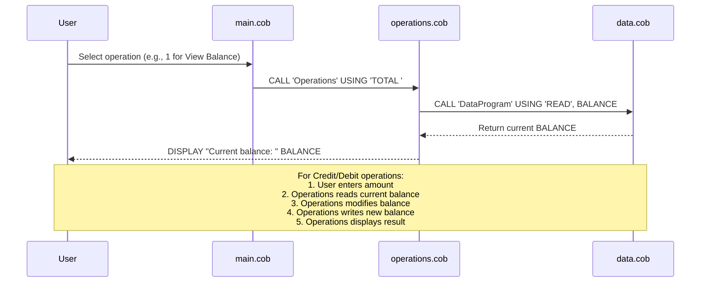

# COBOL Student Account Management System

This document provides an overview of the COBOL files in the `src/cobol/` directory, their purposes, key functions, and business rules related to student accounts.

## COBOL Files Overview

### data.cob
**Purpose**: This program serves as a simple data storage module for managing the account balance.

**Key Functions**:
- Stores the current balance in working storage (initially set to 1000.00)
- Provides read/write operations for the balance through linkage section parameters
- Handles 'READ' operations to retrieve the current balance
- Handles 'WRITE' operations to update the stored balance

**Business Rules**:
- Balance is stored as a numeric field with 6 digits before decimal and 2 after (PIC 9(6)V99)
- Initial balance is set to 1000.00

### main.cob
**Purpose**: This is the main entry point of the application, providing a user interface for account management operations.

**Key Functions**:
- Displays a menu-driven interface for account operations
- Accepts user input for operation selection
- Calls the Operations program based on user choice
- Handles program exit

**Business Rules**:
- Menu options: View Balance (1), Credit Account (2), Debit Account (3), Exit (4)
- Program continues until user chooses to exit
- Invalid choices are handled with error messages

### operations.cob
**Purpose**: This program contains the core business logic for performing account operations.

**Key Functions**:
- Processes different operation types: TOTAL (view balance), CREDIT (add funds), DEBIT (subtract funds)
- Interacts with the DataProgram for balance storage and retrieval
- Handles user input for amounts in credit/debit operations
- Displays operation results and current balance

**Business Rules**:
- **Credit Operation**: Allows adding any positive amount to the account balance
- **Debit Operation**: Allows subtracting amounts only if sufficient funds are available
  - If debit amount exceeds current balance, displays "Insufficient funds" message
  - Only processes debit if balance >= debit amount
- **View Balance**: Displays the current account balance
- All operations update and display the new balance after successful transactions
- Amounts are handled as numeric fields with 6 digits before decimal and 2 after (PIC 9(6)V99)

## System Architecture
The system follows a modular design:
- `main.cob` handles user interaction
- `operations.cob` contains business logic and calls `data.cob` for data persistence
- `data.cob` manages data storage operations

This separation allows for maintainable and extensible code structure.

## Sequence Diagram

The following sequence diagram illustrates the data flow for a typical account operation (viewing balance):

